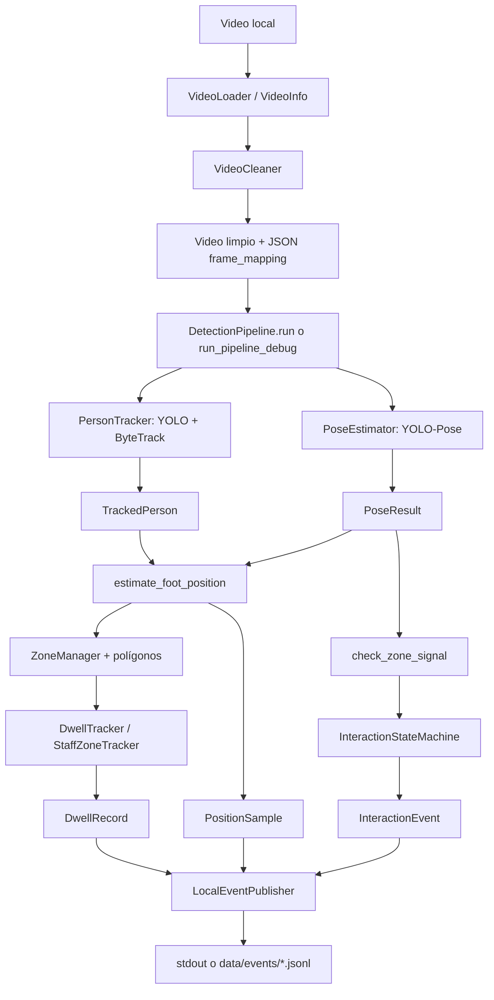
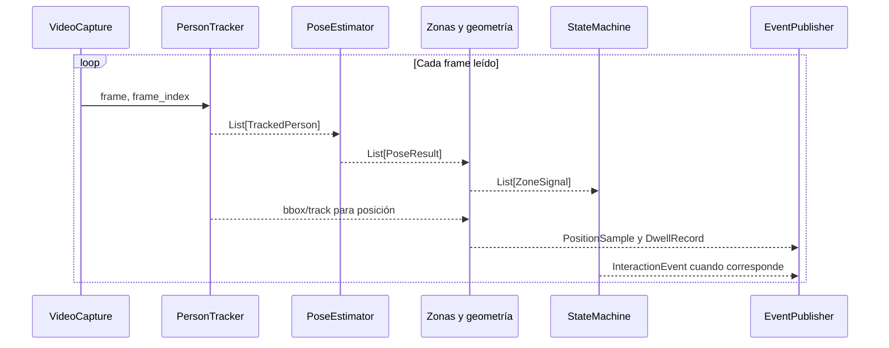
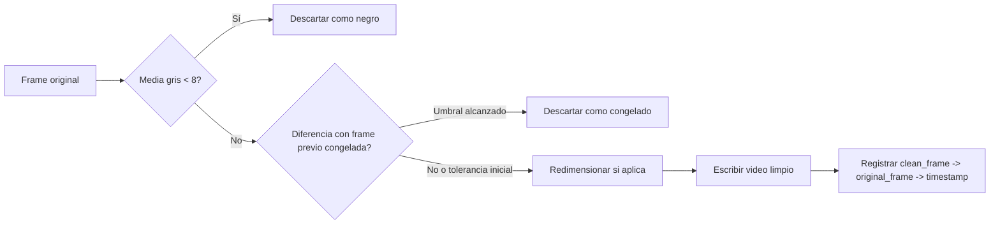
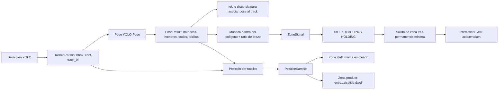
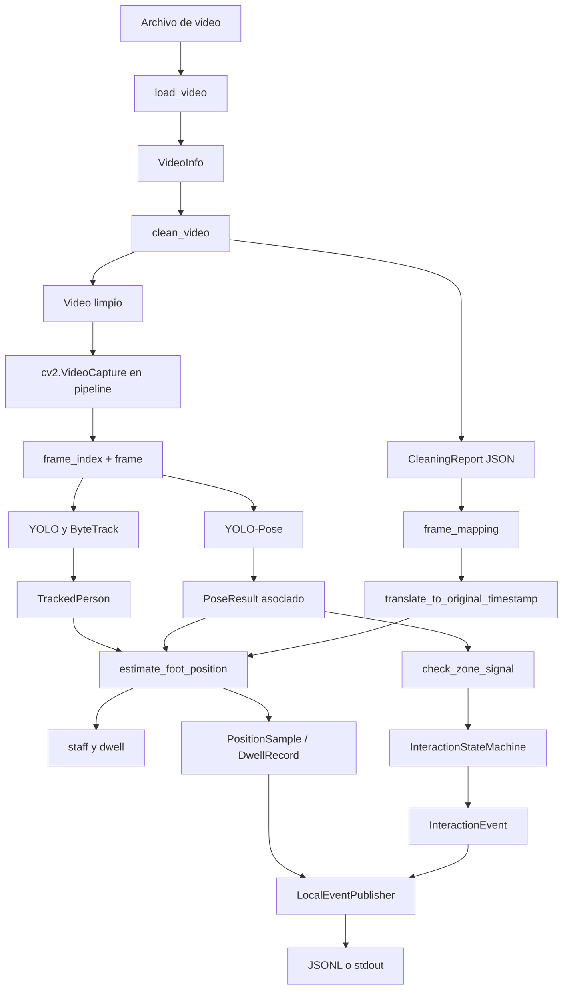

# Inteligencia Artificial

## 1. Introducción

Este documento describe la implementación efectiva de visión computacional del repositorio **Scapder Vision — Prototipo**. La descripción se basa en el código ejecutable, los pesos incluidos, la configuración, los scripts y las pruebas existentes. Se distingue entre inferencia de modelos, procesamiento de imagen, algoritmos geométricos, tracking, reglas de negocio y persistencia.

La aplicación analiza video local para localizar personas, conservar una identidad temporal por persona, estimar articulaciones corporales y derivar señales de interacción con zonas de producto. El resultado final no es una predicción directa del modelo, sino una cadena de transformaciones que termina en eventos `interaction`, registros de posición y registros de permanencia (`dwell`).

> **Estado de evidencia:** el uso de modelos y parámetros descrito aquí está confirmado por el código. No se presentan como hechos la versión exacta de Ultralytics, el hardware de ejecución ni métricas experimentales que no estén almacenadas en el repositorio.

## 2. Objetivo de la Inteligencia Artificial en el proyecto

El objetivo de la IA es proporcionar las observaciones visuales que el sistema necesita para analizar el comportamiento de personas frente a una góndola:

1. detectar personas en cada frame;
2. asignarles un `track_id` para relacionar observaciones entre frames;
3. estimar keypoints corporales, en particular hombros, codos, muñecas y tobillos;
4. entregar coordenadas y confianzas para que el código determine posición, interacción con zonas y permanencia.

El sistema **no** contiene un modelo aprendido que clasifique directamente las acciones `taken` o `returned`. La decisión de generar un evento se implementa mediante geometría y una máquina de estados determinista. En el flujo actual, cuando la evidencia satisface las reglas, la acción emitida es siempre `taken`.

## 3. Arquitectura general

El punto de entrada de la aplicación de escritorio es `main()` en [`app/main.py`](../app/main.py). La pestaña actualmente conectada en [`app/ui/main_window.py`](../app/ui/main_window.py) carga videos, extrae una miniatura y ejecuta la limpieza en un `QThread`. Las pestañas de detección, interacción y dashboard aparecen solo como comentarios de futuras extensiones.

El análisis de IA se inicializa y ejecuta desde [`scripts/run_pipeline_debug.py`](../scripts/run_pipeline_debug.py), que crea `PersonTracker`, `PoseEstimator`, `InteractionStateMachine`, `DwellTracker`, `StaffZoneTracker` y `LocalEventPublisher`. La clase reutilizable que concentra el mismo recorrido es `DetectionPipeline` en [`app/core/pipeline.py`](../app/core/pipeline.py).



## 4. Flujo general de procesamiento



El recorrido real es:

1. `cv2.VideoCapture` abre el video limpio.
2. `PersonTracker.track()` invoca el modelo detector con tracking persistente.
3. Si existe una detección con ID, se construye un `TrackedPerson` con bounding box, confianza, índice de frame e ID.
4. `PoseEstimator.estimate()` ejecuta el modelo de pose sobre el mismo frame y empareja cada bounding box de pose con un track.
5. `estimate_foot_position()` usa tobillos confiables o, como respaldo, el centro inferior de la bounding box.
6. La posición se compara con polígonos cargados por `ZoneManager`. Esto produce permanencia en zonas de producto y marca de empleado en zonas `staff`.
7. Las muñecas y la extensión de los brazos producen `ZoneSignal` para cada zona válida.
8. `InteractionStateMachine.process()` actualiza el estado por pareja `(track_id, zone_id)`.
9. Al abandonar una zona desde `HOLDING` después del mínimo configurado, emite `InteractionEvent`.
10. `DetectionPipeline` traduce el timestamp al video original y publica las salidas mediante `EventPublisher`.

## 5. Entrada de datos

### 5.1 Video

[`app/core/video_loader.py`](../app/core/video_loader.py) implementa `load_video()`. Comprueba existencia, extensión (`.mp4`, `.avi`, `.mov`, `.mkv`, `.wmv`), tamaño máximo y apertura mediante OpenCV. Obtiene FPS, cantidad de frames, ancho y alto, y lee un primer frame para verificar que el archivo sea legible. No recorre el video completo durante la carga.

La duración se calcula como:

$$
\mathrm{duration\_sec} = \frac{\mathrm{frame\_count}}{\mathrm{fps}}
$$

Los límites configurados son `MAX_VIDEO_DURATION_SEC = 43200` segundos y `MAX_VIDEO_SIZE_MB = 10000`. Si OpenCV no reporta FPS, `load_video()` usa `25.0` como valor de respaldo.

`extract_thumbnail()` reabre el video y obtiene, por defecto, el frame situado en `frame_position_ratio = 0.1`. La miniatura se guarda localmente en `data/logs` desde la UI.

### 5.2 Video limpio y correspondencia temporal

[`app/core/video_cleaner.py`](../app/core/video_cleaner.py) implementa `clean_video()`. Lee cada frame, elimina frames cuyo promedio de intensidad en escala de grises es menor que `BLACK_FRAME_MEAN_THRESHOLD` (`8.0`) y detecta repetición consecutiva mediante la desviación estándar de la diferencia absoluta entre frames (`FROZEN_FRAME_STD_THRESHOLD = 2.0`). A partir de `MAX_CONSECUTIVE_FROZEN_FRAMES = 15`, descarta frames congelados.

Después puede redimensionar al tamaño configurado, aunque `DEFAULT_TARGET_RESOLUTION` es `None`, y reencoda con `mp4v` en un archivo `*_clean.mp4`. El proceso no es un modelo de IA: es filtrado de imagen y escritura de video.

`CleaningReport` guarda contadores y `frame_mapping`. Para cada frame conservado registra:

- `clean_frame`;
- `original_frame`;
- `original_timestamp_sec`.

[`app/core/frame_mapping.py`](../app/core/frame_mapping.py) implementa `translate_to_original_timestamp()`, que hace una búsqueda exacta o del frame limpio más cercano. Si el mapping no existe, el pipeline usa `frame_index / fps`.



## 6. Modelo de Inteligencia Artificial

### 6.1 Modelos y framework

El repositorio incluye dos pesos locales:

- [`yolo11n.pt`](../yolo11n.pt), cargado por `PersonTracker`.
- [`yolo11n-pose.pt`](../yolo11n-pose.pt), cargado por `PoseEstimator`.

Ambos se cargan con `from ultralytics import YOLO`. Los pesos contienen referencias a módulos `torch` y `ultralytics`; por tanto, el runtime es PyTorch a través de Ultralytics. `requirements.txt` declara `ultralytics`, `opencv-python` y `numpy`, entre otras dependencias. No declara una versión fijada de Ultralytics. `uv.lock` solo contiene metadatos mínimos del proyecto y requiere Python `>=3.13`; no permite determinar una versión efectiva de la librería.

El nombre `yolo11n` identifica la variante nano de YOLO11 según la nomenclatura del peso y el código. El repositorio no contiene el archivo de entrenamiento, un dataset propio, un checkpoint de entrenamiento del proyecto ni una configuración de fine-tuning. `config.py` los describe como preentrenados sobre COCO y COCO-Keypoints. Por ello, la evidencia disponible permite documentarlos como pesos preentrenados incluidos, no como modelos entrenados específicamente para este proyecto.

### 6.2 Tabla del modelo

| Característica | Valor |
|---|---|
| Modelo detector | Peso local `yolo11n.pt` |
| Modelo de pose | Peso local `yolo11n-pose.pt` |
| Variante | `yolo11n` / variante nano, según el nombre del peso |
| Arquitectura | YOLO11; detalle interno no especificado por el código del proyecto |
| Framework | PyTorch, usado a través de Ultralytics |
| Librería | `ultralytics` |
| Tarea detector | Detección de personas, seguida de tracking |
| Tarea de pose | Estimación de pose humana |
| Entrenamiento | Preentrenado COCO / COCO-Keypoints según `config.py`; no hay entrenamiento propio implementado |
| Entrada | Frame BGR `numpy.ndarray` leído por OpenCV |
| Salida detector | Bounding boxes, confianza e ID de tracking cuando Ultralytics lo asigna |
| Salida pose | Bounding boxes y arrays `xy`/`conf` de keypoints; se consumen 17 keypoints COCO |
| Clases detector | Se filtra `classes=[0]`, clase `persona` de COCO |
| Confianza detector | `0.4` (`DETECTION_CONF_THRESHOLD`) |
| IoU detector | `0.5` (`DETECTION_IOU_THRESHOLD`), usado por la llamada de inferencia/tracking |
| Configuración de tracker | `bytetrack.yaml` |
| Tamaño del modelo | No determinado en el código/configuración analizada |
| Resolución de inferencia | No determinada; no se pasa `imgsz` explícito |
| Dispositivo | No determinado; no se pasa `device` explícito |
| FPS de inferencia | No fijado; se procesa cada frame leído |
| Umbral explícito de pose | No se pasa `conf` al invocar `self.model(frame)`; se filtran keypoints después con `0.3` en las reglas geométricas |

### 6.3 Detección y tracking

`PersonTracker.__init__()` crea `YOLO(model_name)`. En `track()`, la llamada es:

```python
self.model.track(
    frame,
    persist=True,
    tracker="bytetrack.yaml",
    conf=0.4,
    iou=0.5,
    classes=[0],
    verbose=False,
)
```

La detección restringe el interés a personas. `persist=True` solicita conservar el estado temporal del tracker entre frames. ByteTrack es el algoritmo de asociación usado por la integración de Ultralytics; el proyecto no implementa una asociación propia ni modifica el contenido de `bytetrack.yaml`.

Para cada caja con `box.id` disponible, `track()` extrae `box.id`, `box.conf` y `box.xyxy`, y crea `TrackedPerson`. Si una caja no tiene ID, se omite; por tanto, una detección sin identidad no continúa hacia pose, posición ni eventos.

La detección y el tracking son conceptos distintos: el modelo produce observaciones visuales y la integración ByteTrack mantiene una identidad temporal. El `track_id` es un identificador efímero de la sesión; no es una identidad biométrica ni se valida contra el `track_id` opcional del ground truth.

### 6.4 Estimación de pose

`PoseEstimator.__init__()` carga `YOLO(POSE_MODEL_NAME)`. En cada frame con al menos una persona trackeada, `estimate()` invoca `self.model(frame, verbose=False)`. Recorre los resultados y exige que existan `result.keypoints`, `result.boxes` y `result.keypoints.conf`.

El modelo entrega coordenadas `result.keypoints.xy` con forma esperada `(N, 17, 2)` y confianzas `result.keypoints.conf` con forma `(N, 17)`. El código selecciona los índices COCO:

| Índice | Keypoint usado |
|---:|---|
| 5 | hombro izquierdo |
| 6 | hombro derecho |
| 7 | codo izquierdo |
| 8 | codo derecho |
| 9 | muñeca izquierda |
| 10 | muñeca derecha |
| 15 | tobillo izquierdo |
| 16 | tobillo derecho |

Se construye `PoseResult` con esos ocho keypoints, sus coordenadas, confianza, `frame_index` y el `track_id` emparejado. Los otros keypoints COCO pueden existir en la salida del modelo, pero no son conservados en el esquema del proyecto.

### 6.5 Emparejamiento pose-track

El modelo de pose se ejecuta separadamente del tracker. `PoseEstimator._match_pose_to_track()` asocia cada bounding box de pose con la persona trackeada que tenga el mayor IoU. Si el mejor IoU es al menos `POSE_TRACK_MATCH_IOU_MIN = 0.25`, se usa ese track.

Cuando no hay suficiente solapamiento, usa como fallback la distancia euclidiana cuadrada entre centroides y acepta el menor valor si es menor que `POSE_TRACK_MATCH_MAX_DIST_SQ = 22500` píxeles cuadrados. Este emparejamiento es lógica determinista del proyecto, no una salida aprendida adicional.

## 7. Procesamiento de las predicciones

### 7.1 Posición

[`app/core/position.py`](../app/core/position.py) implementa `estimate_foot_position()`. Si uno o ambos tobillos tienen confianza al menos `MIN_KEYPOINT_CONFIDENCE = 0.3`, usa el promedio de ambos o el tobillo confiable disponible. Si ninguno es confiable, usa `(x1+x2)/2, y2`, el centro inferior de la bounding box.

El resultado es un `PositionSample` con coordenadas de píxel, timestamp, frame, track y `source` (`ankle_keypoint` o `bbox_bottom_center`). Estas coordenadas no se transforman a metros ni a un sistema de coordenadas del mundo.

### 7.2 Zonas

[`app/core/zone.py`](../app/core/zone.py) carga objetos `Zone` desde `data/zones/<video_id>/*.json` mediante `ZoneManager.load_zones()`. Una zona tiene `zone_id`, `video_id`, nombre, polígono y tipo `product` o `staff`. Las pruebas y archivos de datos muestran polígonos en coordenadas de píxel.

`is_point_in_polygon()` usa `shapely.geometry.Point` y `Polygon`, y considera dentro únicamente un punto que satisface `Point.within(poly)`. Un polígono con menos de tres puntos se ignora. Se cachean los polígonos para evitar reconstruirlos en cada llamada.

### 7.3 Señal de interacción

`check_zone_signal()` calcula una señal por pose y por zona válida. Primero exige confianza mínima de muñeca y hombro para cada brazo. Para cada lado calcula:

$$
\mathrm{extension\_ratio} =
\frac{d(\mathrm{muñeca},\mathrm{hombro})}
     {d(\mathrm{hombro},\mathrm{codo})}
$$

El brazo es considerado extendido si la razón es al menos `ARM_EXTENSION_MIN_RATIO = 1.3`, siempre que el denominador no sea prácticamente cero. La muñeca se considera dentro si el punto cae en el polígono. `wrist_inside` es la disyunción de ambas muñecas; `arm_extended` es verdadero solo si el brazo que está dentro también cumple la regla de extensión.

No hay detección de productos, manos que sujeten objetos, apertura de estantes ni reconocimiento de acción. La señal representa una aproximación geométrica a una interacción.

### 7.4 Presencia y dwell time

[`app/core/presence.py`](../app/core/presence.py) implementa `DwellTracker`. Para cada `PositionSample` y cada zona `product`, registra el timestamp de entrada en `active_entries[(track_id, zone_id)]`. Cuando la posición deja el polígono, emite un `DwellRecord` con entrada, salida y:

$$
\mathrm{duration\_sec} = \mathrm{exit\_timestamp} - \mathrm{entry\_timestamp}
$$

Las zonas `staff` se excluyen del dwell. Si un track desaparece mientras está dentro, no existe expiración: la entrada puede permanecer abierta indefinidamente. Esto está indicado en el propio módulo y es una limitación confirmada por el código.

### 7.5 Identificación heurística de empleados

[`app/core/staff.py`](../app/core/staff.py) implementa `StaffZoneTracker`. Si la posición de un track entra en cualquier zona `staff`, el ID se agrega a `known_employee_tracks`. La marca es persistente durante el resto del video, aunque la persona salga de la zona. No es un clasificador de personas ni usa apariencia, uniforme, rostro o atributos biométricos.



## 8. Máquina de estados

[`app/core/state_machine.py`](../app/core/state_machine.py) mantiene un estado por `(track_id, zone_id)`:

- `IDLE`: no hay interacción activa;
- `REACHING`: muñeca dentro y brazo extendido;
- `HOLDING`: se ha mantenido `REACHING` durante el mínimo configurado.

Las transiciones deterministas son:

1. `IDLE -> REACHING` cuando `wrist_inside` y `arm_extended` son verdaderos.
2. `REACHING -> HOLDING` después de `MIN_FRAMES_REACHING_TO_HOLDING = 5` frames consecutivos con brazo extendido dentro.
3. `REACHING -> IDLE` si la muñeca sale o si queda dentro sin brazo extendido durante `round(fps * 1.0)` frames (`MAX_SECONDS_STUCK_REACHING`).
4. `HOLDING` acumula frames mientras la muñeca permanece dentro.
5. `HOLDING -> IDLE` al salir. En ese momento emite un evento solo si el contador alcanza `MIN_FRAMES_HOLDING = 8`.
6. Si un track activo no aparece en las señales durante `MAX_FRAMES_MISSING_TO_RESET = 10` frames, todos sus estados se reinician a `IDLE` sin evento.

El evento creado tiene `action="taken"` y timestamp temporalmente igual a `0.0`; `DetectionPipeline` lo sustituye por `current_timestamp`. La distinción entre tomar y devolver no está implementada porque no existe detección de producto ni clasificador de acción.

## 9. Generación y publicación de eventos

Los esquemas Pydantic se encuentran en [`app/core/schemas.py`](../app/core/schemas.py):

- `TrackedPerson`: observación de una persona con bbox e ID;
- `PoseResult`: keypoints seleccionados;
- `ZoneSignal`: señal geométrica por zona;
- `PositionSample`: posición por frame;
- `DwellRecord`: permanencia cerrada;
- `InteractionEvent`: evento de interacción.

En `DetectionPipeline.run()` se publican tres clases de salida:

1. `PositionSample`, una por persona trackeada y frame;
2. `DwellRecord`, al abandonar una zona de producto;
3. `InteractionEvent`, cuando la máquina de estados confirma una interacción.

[`app/core/event_publisher.py`](../app/core/event_publisher.py) define la interfaz `EventPublisher` y la implementación `LocalEventPublisher`. Con `mode="file"`, serializa cada modelo con `model_dump()` y escribe una línea JSON en `data/events/events_session_<timestamp>.jsonl`. Con `mode="stdout"`, imprime el JSON. El modo websocket aparece como placeholder y no implementa transporte de red.

## 10. Flujo completo de extremo a extremo



Este comportamiento no se encuentra implementado en el código analizado: inferencia en streaming desde cámara en vivo, almacenamiento de trayectorias separado, reconocimiento de producto, clasificación `returned`, reconocimiento facial, entrenamiento del modelo, dashboard de métricas y comunicación WebSocket.

## 11. Componentes y responsabilidades

| Componente | Archivo | Responsabilidad | ¿IA/ML? | Entrada | Salida |
|---|---|---|---|---|---|
| Punto de entrada Qt | [`app/main.py`](../app/main.py) | Inicia la aplicación de escritorio | No | Argumentos del proceso | `MainWindow` |
| Carga de video | [`app/core/video_loader.py`](../app/core/video_loader.py) | Valida y obtiene metadatos | No | Ruta de video | `VideoInfo` |
| Limpieza | [`app/core/video_cleaner.py`](../app/core/video_cleaner.py) | Filtra negros/congelados y reencoda | No, visión clásica | Frames OpenCV | Video limpio y `CleaningReport` |
| Mapping temporal | [`app/core/frame_mapping.py`](../app/core/frame_mapping.py) | Traduce frame limpio a tiempo original | No | Índice y JSON mapping | Timestamp |
| Detección + tracking | [`app/core/tracker.py`](../app/core/tracker.py) | Ejecuta `yolo11n.pt` con ByteTrack | Sí, más tracking | Frame BGR | `TrackedPerson` |
| Pose | [`app/core/pose.py`](../app/core/pose.py) | Ejecuta `yolo11n-pose.pt` y selecciona keypoints | Sí | Frame BGR y tracks | `PoseResult` |
| Matching pose-track | [`app/core/pose.py`](../app/core/pose.py) | Usa IoU y distancia de centroides | No | Bboxes | Track asociado |
| Posición | [`app/core/position.py`](../app/core/position.py) | Estima punto de apoyo | No, usa salida de IA | Track y pose | `PositionSample` |
| Zonas | [`app/core/zone.py`](../app/core/zone.py) | Carga polígonos y prueba pertenencia | No, geometría | Punto y polígono | `bool` / `ZoneSignal` |
| ROI candidato | [`app/core/roi_suggest.py`](../app/core/roi_suggest.py) | Canny, contornos y rectángulos | No, visión clásica | Frame | Polígonos candidatos |
| Presencia | [`app/core/presence.py`](../app/core/presence.py) | Mide entradas y salidas de zonas product | No | Posiciones | `DwellRecord` |
| Staff | [`app/core/staff.py`](../app/core/staff.py) | Marca tracks que entran a zona staff | No | Posiciones y zonas | Marca booleana |
| Máquina de estados | [`app/core/state_machine.py`](../app/core/state_machine.py) | Convierte señales temporales en eventos | No | `ZoneSignal` | `InteractionEvent` |
| Orquestación | [`app/core/pipeline.py`](../app/core/pipeline.py) | Coordina todo por frame | No | Video y componentes | Eventos publicados |
| Publicación | [`app/core/event_publisher.py`](../app/core/event_publisher.py) | Escribe JSONL o stdout | No | Modelos Pydantic | Persistencia local |
| Depuración visual | [`scripts/run_pipeline_debug.py`](../scripts/run_pipeline_debug.py) | Ejecuta pipeline y dibuja resultados | No | Video limpio | Ventana OpenCV y eventos |
| Evaluación | [`scripts/evaluate_events.py`](../scripts/evaluate_events.py) | Compara eventos con ground truth | No | CSV y JSONL | Precision/recall/F1 |

## 12. Evaluación

### 12.1 Evaluación de eventos

[`scripts/evaluate_events.py`](../scripts/evaluate_events.py) carga un CSV de ground truth manual y filtra del JSONL únicamente objetos con `event_type == "interaction"`. `match_events()` agrupa por `zone_id` y realiza un emparejamiento greedy del evento detectado no usado más cercano en el tiempo, siempre que la diferencia sea menor o igual a `--tolerance-sec`.

La tolerancia por defecto es `2.0` segundos. El `track_id` del ground truth se considera informativo y no se exige que coincida. La acción se compara aparte (`action_match`) y no afecta a TP, FP o FN.

Las métricas implementadas son:

$$
\mathrm{precision} = \frac{TP}{TP + FP}
$$

$$
\mathrm{recall} = \frac{TP}{TP + FN}
$$

$$
F1 = \frac{2 \cdot precision \cdot recall}{precision + recall}
$$

También se imprime el porcentaje de matches con `action_match=True`. El script no calcula mAP de detección, precisión de keypoints, OKS, IoU de tracking, MOTA, IDF1, tasa de pérdida de identidad ni métricas por zona/persona.

No hay resultados numéricos de una ejecución de `evaluate_events.py` versionados en el repositorio. Por tanto, la precisión, recall y F1 reales del sistema no están determinados en este documento.

### 12.2 Pruebas existentes

La suite `tests/` contiene pruebas unitarias de:

- [`tests/test_presence.py`](../tests/test_presence.py): entrada, permanencia, salida, reentrada, múltiples tracks y exclusión de zonas staff;
- [`tests/test_staff.py`](../tests/test_staff.py): marcación persistente de empleados, independencia de tracks y exclusión de zonas product;
- [`tests/test_state_machine.py`](../tests/test_state_machine.py): flujo completo, interrupción en `REACHING`, pérdida de tracking, múltiples tracks y atasco.

Estas pruebas validan reglas deterministas con datos sintéticos. No prueban inferencia real con los pesos, calidad de tracking en video, asociación pose-track con imágenes, limpieza sobre archivos reales ni integración de extremo a extremo.

### 12.3 Ground truth

[`data/eval/ground_truth_template.csv`](../data/eval/ground_truth_template.csv) define las columnas `timestamp,zone_id,track_id,action` y contiene ejemplos. La plantilla incluye una acción `returned`, pero el pipeline actual siempre genera `taken`; por ello, los casos `returned` sirven para revelar la limitación de la implementación y no para demostrar que exista esa capacidad.

## 13. Limitaciones

### Confirmadas por código

- **No hay acción `returned`:** la máquina de estados siempre emite `taken`.
- **No hay detección de productos:** el evento se infiere solo con muñeca, zona y ratio geométrico del brazo.
- **Pérdida de tracking:** una detección sin `box.id` se omite; tras 10 frames sin señales, el estado se reinicia sin evento.
- **Dwell abierto:** si desaparece un track dentro de una zona, `DwellTracker` no expira la entrada.
- **Identidad de empleado heurística:** basta entrar una vez en una zona `staff`; el marcado permanece hasta el final de la sesión.
- **Dependencia de calibración espacial:** los polígonos están en píxeles y dependen de la vista y resolución del video.
- **Timestamp aproximado sin mapping:** sin JSON de limpieza, el tiempo se obtiene mediante FPS; con mapping, la traducción usa el frame original registrado o el más cercano.
- **Ausencia de métricas del modelo:** no hay evaluación de detección, pose o tracking en el repositorio.
- **UI incompleta para IA:** la ventana Qt no ejecuta actualmente el pipeline de detección; la ruta demostrable es el script de depuración.
- **Posible inconsistencia al configurar resolución/FPS:** `clean_video()` puede comparar el frame original con `prev_frame` redimensionado si se usa una resolución objetivo distinta. Además, `target_fps` cambia el FPS declarado del writer, pero no implementa muestreo, duplicación o eliminación temporal de frames.

### Limitaciones potenciales y recomendaciones

Estas condiciones no se miden en el repositorio, pero son riesgos técnicos esperables que deberían validarse con datos representativos: oclusiones, iluminación extrema, personas parcialmente visibles, ángulos de cámara, baja resolución, escala de personas, cruces entre personas y saturación de CPU/GPU. Se recomienda crear un conjunto anotado por frame para medir precisión de detección, recall, mAP, calidad de keypoints y métricas de identidad del tracker antes de afirmar rendimiento.

También sería recomendable hacer explícito el dispositivo y el tamaño de inferencia, fijar la versión de Ultralytics y registrar la configuración de cada corrida para facilitar reproducibilidad.

## 14. Seguridad y privacidad

El procesamiento mostrado es local: OpenCV lee archivos locales, los pesos están en el repositorio y `LocalEventPublisher` escribe en `data/events`. No hay llamadas a una API externa, WebSocket implementado ni servicio remoto de IA. La aplicación guarda miniaturas en `data/logs`; esas imágenes pueden contener personas reconocibles. El JSONL puede contener `track_id`, posiciones, timestamps y eventos.

El sistema no implementa reconocimiento facial ni guarda explícitamente vectores biométricos. Sin embargo, los videos, miniaturas y posiciones de personas pueden constituir datos personales según el contexto de uso. El repositorio no muestra cifrado, control de acceso, política de retención, anonimización, eliminación automática ni protección de los archivos generados.

**Recomendaciones separadas de la implementación actual:** restringir permisos de `data/`, definir retención y borrado, evitar incluir videos/miniaturas en respaldos innecesarios, proteger los JSONL, documentar la base legal y señalización del análisis, y anonimizar imágenes si las futuras interfaces las exponen.

## 15. Consideraciones de rendimiento

La limpieza y el pipeline recorren el video frame a frame. `VideoCleaningWorker` mueve la limpieza a un `QThread` para no bloquear la UI. El pipeline de IA no tiene un worker Qt activo: el script de depuración ejecuta las inferencias en su hilo principal.

`PersonTracker` y `PoseEstimator` cargan una instancia de modelo cada uno. Se ejecutan dos pasos de modelo por frame cuando hay personas: `model.track()` y `model(frame)`. El proyecto no define `device`, `imgsz`, `half`, batch, límite de FPS ni medición de latencia. El FPS de proceso real, consumo de memoria y rendimiento en hardware específico no están determinados.

Hay optimizaciones deterministas en el mapping temporal: `frame_mapping.py` cachea estructuras y usa búsqueda binaria. `zone.py` cachea polígonos de Shapely. Estas optimizaciones no alteran las predicciones de los modelos.

## 16. Posibles mejoras

Las siguientes son propuestas, no capacidades actuales:

1. fijar la versión de Python, Ultralytics y PyTorch y registrar el dispositivo usado;
2. añadir pruebas de integración con un video corto y pesos controlados;
3. medir detección, pose y tracking por separado, además de eventos;
4. cerrar dwell records cuando se pierde un track;
5. reemplazar la heurística de `taken`/`returned` por un clasificador de acción o una regla respaldada por evidencia de producto;
6. validar y visualizar polígonos respecto a la resolución efectiva del video;
7. agregar una interfaz Qt para ejecutar el pipeline y visualizar resultados;
8. incorporar anonimización, retención y protección de archivos;
9. corregir el manejo temporal cuando se configura `target_fps` o resolución diferente durante la limpieza.

## 17. Conclusiones

La IA del proyecto está compuesta por dos usos de YOLO mediante Ultralytics: `yolo11n.pt` para detectar personas y alimentar el tracking ByteTrack, y `yolo11n-pose.pt` para estimar la pose humana. Ambos modelos entregan observaciones visuales: bounding boxes, confianzas, IDs de tracking y keypoints.

La conversión de esas observaciones en decisiones pertenece principalmente al código del proyecto. `PoseEstimator` asocia pose y track; `position.py` estima el punto de apoyo; `zone.py` aplica geometría de polígonos y una razón de extensión del brazo; `presence.py` calcula dwell; `staff.py` marca empleados; `state_machine.py` aplica temporalidad y genera `taken`; `event_publisher.py` persiste los modelos serializados.

En consecuencia, la respuesta precisa a «qué IA utiliza este proyecto» es: **dos pesos locales YOLO11 nano, uno de detección y otro de pose, ejecutados con Ultralytics/PyTorch, integrados con ByteTrack; las decisiones de zona, presencia, estado y evento son reglas deterministas posteriores**. La versión exacta de las dependencias, el hardware y el desempeño cuantitativo no están determinados por los archivos analizados.

## 18. Referencias al código

- [`app/core/tracker.py`](../app/core/tracker.py): carga `yolo11n.pt`, invoca `model.track()` y construye `TrackedPerson`.
- [`app/core/pose.py`](../app/core/pose.py): carga `yolo11n-pose.pt`, extrae keypoints y asocia pose con tracks.
- [`app/core/pipeline.py`](../app/core/pipeline.py): orquesta el recorrido por frame y la publicación.
- [`app/core/zone.py`](../app/core/zone.py): polígonos, señales y heurística de extensión.
- [`app/core/position.py`](../app/core/position.py): posición por tobillos o bbox.
- [`app/core/presence.py`](../app/core/presence.py): permanencia por zona product.
- [`app/core/state_machine.py`](../app/core/state_machine.py): estados y emisión de `taken`.
- [`app/core/event_publisher.py`](../app/core/event_publisher.py): salida local JSONL/stdout.
- [`app/core/video_cleaner.py`](../app/core/video_cleaner.py): limpieza previa y mapping.
- [`scripts/run_pipeline_debug.py`](../scripts/run_pipeline_debug.py): ejecución manual con visualización.
- [`scripts/evaluate_events.py`](../scripts/evaluate_events.py): evaluación offline de eventos.
- [`app/utils/config.py`](../app/utils/config.py): modelos, thresholds y reglas.
- [`requirements.txt`](../requirements.txt): dependencias declaradas.
- [`README.md`](../README.md): contexto de prototipo y comandos de ejecución.
